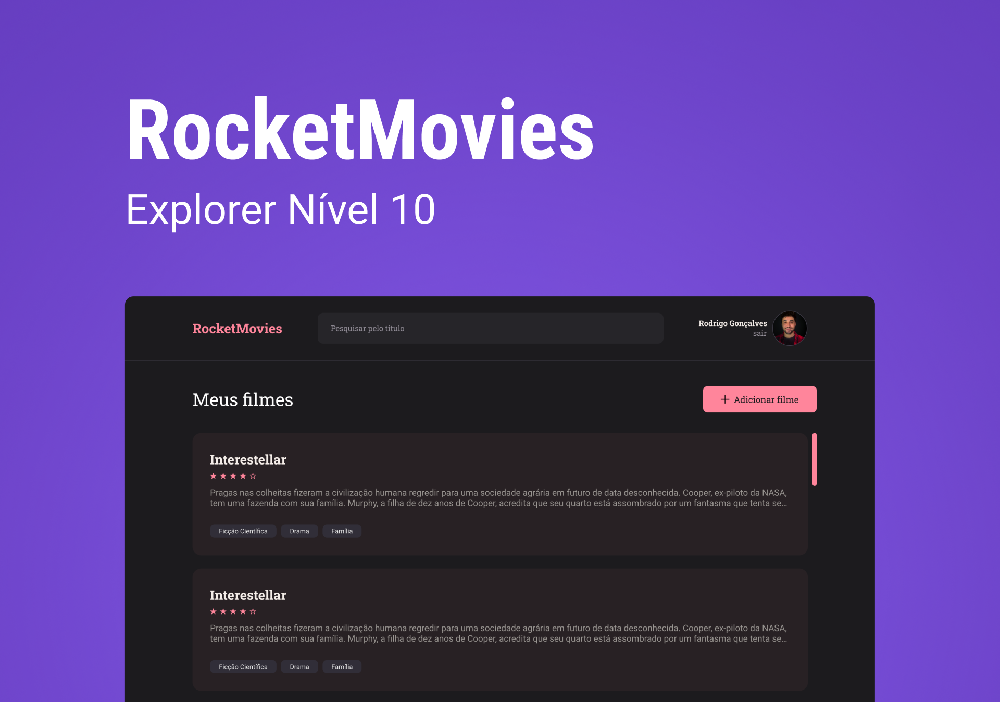

<h1 align="center"> PT-BR </h1>
<h1 align="center"> Explorer - Stage 09 | Rocket Movies</h1>

Programa exclusivo, promovido pela Rocketseat para ensino de tecnologias Front-end e Back-end.

  <a href="#-tecnologias">Tecnologias</a>&nbsp;&nbsp;&nbsp;|&nbsp;&nbsp;&nbsp;
  <a href="#-projeto">Projeto</a>&nbsp;&nbsp;&nbsp;|&nbsp;&nbsp;&nbsp;
  <a href="#memo-licença">Licença</a>

  

 

  

## 🚀 Tecnologias

Esse projeto foi desenvolvido com as seguintes tecnologias:

- Git e Github
- JavaScript
- React JS
- Styled Components
- React Router Dom

## 💻 Projeto

Esse projeto foi desenvolvido para o aprendizado de ReactJS, onde nessa aplicação você consegue navegar pelas os layouts desenvolvidos para o front-end através dos links.

Para ser possível checar as funcionalidades dessa aplicação é preciso rodar o comando no terminal `npm install` para instalar as dependências necessárias, para fazer a aplicação funcionar é possível inicializar com o comando `npm start` e com o comando `npm run dev`.

## :memo: Licença

Esse projeto está sob a licença MIT.

---

Feito com ♥ by Rocketseat :wave: [Participe da nossa comunidade!](https://discord.gg/rocketseat)

 

<h1 align="center"> English </h1>

<h1 align="center"> Explorer - Stage 09 | Rocket Movies</h1>

Exclusive program, promoted by Rocketseat for teaching WEB technologies.

  <a href="#-technologies">Technologies</a>&nbsp;&nbsp;&nbsp;|&nbsp;&nbsp;&nbsp;
  <a href="#-project">Projects</a>&nbsp;&nbsp;&nbsp;|&nbsp;&nbsp;&nbsp;
  <a href="#memo-license">License</a>

  

  

## 🚀 Technologies

This project was developed with the following technologies:

- Git e Github
- JavaScript
- React JS
- Styled Components
- React Router Dom

## 💻 Project

This project was developed with the purpose of learning ReactJS, where in this application you can navigate through the layouts developed for the front-end through the links.

To be able to check the functionalities of this application it is necessary to run the command `npm install` in the terminal to install the necessary dependencies, to make the application work it is possible to start it with the command `npm start` and with the command `npm run dev`.
## :memo: License

This project is licensed under the MIT license.

---

Made with ♥ by Rocketseat :wave: [Take part of your community!](https://discord.gg/rocketseat)